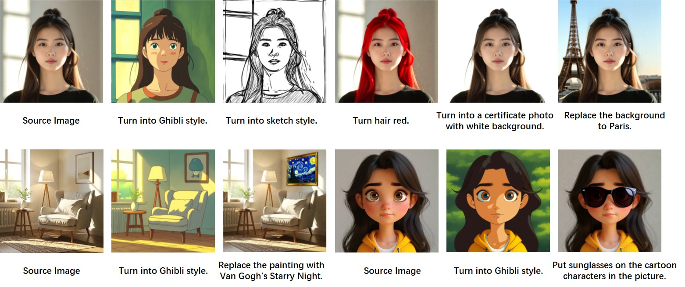

# HiDream-E1

HiDream-E1 is an image editing model built on [HiDream-I1](https://github.com/HiDream-ai/HiDream-I1).

<!--  -->
<span style="color: #FF5733; font-weight: bold">For more features and to experience the full capabilities of our product, please visit [https://vivago.ai/](https://vivago.ai/).</span>

## Project Updates
- 🚀 **April 28, 2025**: We've open-sourced the instruction-based image editing model **HiDream-E1**. 


## Models

We offer the full version of HiDream-E1. For more information about the models, please refer to the link under Usage.

| Name            | Script                                             | Inference Steps | Resolution | HuggingFace repo       |
| --------------- | -------------------------------------------------- | --------------- | ---------- | ---------------------- |
| HiDream-E1-Full | [inference.py](./inference.py)                     | 28              | 768x768    | 🤗 [HiDream-E1-Full](https://huggingface.co/HiDream-ai/HiDream-E1-Full)  |

## Quick Start
Please make sure you have installed [Flash Attention](https://github.com/Dao-AILab/flash-attention) and latest [Diffusers](https://github.com/huggingface/diffusers.git). We recommend CUDA versions 12.4 for the manual installation.

```sh
pip install -r requirements.txt
pip install -U flash-attn --no-build-isolation
pip install -U git+https://github.com/huggingface/diffusers.git
```

Then you can run the inference scripts to generate images:

``` python 
python ./inference.py
```

Alternatively, you can use the model in your own code:

```python
import torch
from transformers import PreTrainedTokenizerFast, LlamaForCausalLM
from pipeline_hidream_image_editing import HiDreamImageEditingPipeline
from PIL import Image

# Load the tokenizer and text encoder
tokenizer_4 = PreTrainedTokenizerFast.from_pretrained("meta-llama/Llama-3.1-8B-Instruct")
text_encoder_4 = LlamaForCausalLM.from_pretrained(
    "meta-llama/Llama-3.1-8B-Instruct",
    output_hidden_states=True,
    output_attentions=True,
    torch_dtype=torch.bfloat16,
)

# Load the HiDream pipeline
pipe = HiDreamImageEditingPipeline.from_pretrained(
    "HiDream-ai/HiDream-E1-Full",
    tokenizer_4=tokenizer_4,
    text_encoder_4=text_encoder_4,
    torch_dtype=torch.bfloat16,
)

# Load and prepare input image
# The model works best for square images.
test_image = Image.open("assets/test_1.png")
test_image = test_image.resize((768, 768))

# Move pipeline to GPU
pipe = pipe.to("cuda", torch.bfloat16)

# Generate edited image
image = pipe(
    prompt = 'Editing Instruction: Convert the image into a Ghibli style. Target Image Description: A person in a light pink t-shirt with short dark hair, depicted in a Ghibli style against a plain background.',
    negative_prompt = "low resolution, blur",
    image = test_image,
    guidance_scale=5.0,
    image_guidance_scale=4.0,
    num_inference_steps=28,
    generator=torch.Generator("cuda").manual_seed(3),
).images[0]

# Save output image
image.save("output.jpg")
```

> [!NOTE]
> The inference script will try to automatically download `meta-llama/Llama-3.1-8B-Instruct` model files. You need to [agree to the license of the Llama model](https://huggingface.co/meta-llama/Llama-3.1-8B-Instruct) on your HuggingFace account and login using `huggingface-cli login` in order to use the automatic downloader.


> [!NOTE]
> The model accepts instructions in the following format:
> ```
> Editing Instruction: {instruction}. Target Image Description: {description}
> ```
> 
> Example:
> ```
> Editing Instruction: Convert the image into a Ghibli style. Target Image Description: A person in a light pink t-shirt with short dark hair, depicted in a Ghibli style against a plain background.
> ```
> 
> To refine your instructions, use the provided script:
> ```bash
> python ./instruction_refinement.py --src_image ./test.jpeg --src_instruction "convert the image into a Ghibli style"
> ```
> 
> The instruction refinement script requires a VLM API key - you can either run vllm locally or use OpenAI's API.

## Gradio Demo

We also provide a Gradio demo for interactive image editing. You can run the demo with:

``` python
python gradio_demo.py 
```
<!-- 
## Examples

Below are demonstration examples of HiDream-E1's capabilities:

 -->


## Evaluation Metrics

**Evaluation results on EmuEdit and ReasonEdit Benchmarks. Higher is better.**

| Model              | EmuEdit Global | EmuEdit Add  | EmuEdit Text | EmuEdit BG   | EmuEdit Color | EmuEdit Style | EmuEdit Remove | EmuEdit Local | EmuEdit Average | ReasonEdit |
|--------------------|----------------|--------------|--------------|--------------|---------------|---------------|----------------|---------------|-----------------|------------|
| OmniGen            | 1.37           | 2.09         | 2.31         | 0.66         | 4.26          | 2.36          | 4.73           | 2.10          | 2.67            | 7.36       |
| MagicBrush         | 4.06           | 3.54         | 0.55         | 3.26         | 3.83          | 2.07          | 2.70           | 3.28          | 2.81            | 1.75       |
| UltraEdit          | 5.31           | 5.19         | 1.50         | 4.33         | 4.50          | 5.71          | 2.63           | 4.58          | 4.07            | 2.89       |
| Gemini-2.0-Flash   | 4.87           | **7.71** | 6.30         | **5.10** | 7.30          | 3.33          | 5.94           | 6.29          | 5.99            | 6.95       |
| HiDream-E1         | **5.32** | 6.98         | **6.45** | 5.01         | **7.57** | **6.49** | **5.99** | **6.35** | **6.40** | **7.54** |

## License

The code in this repository and the HiDream-E1 models are licensed under [MIT License](./LICENSE).